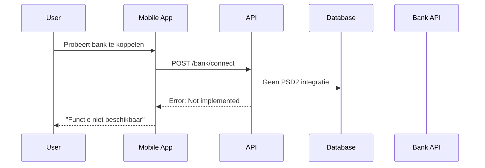
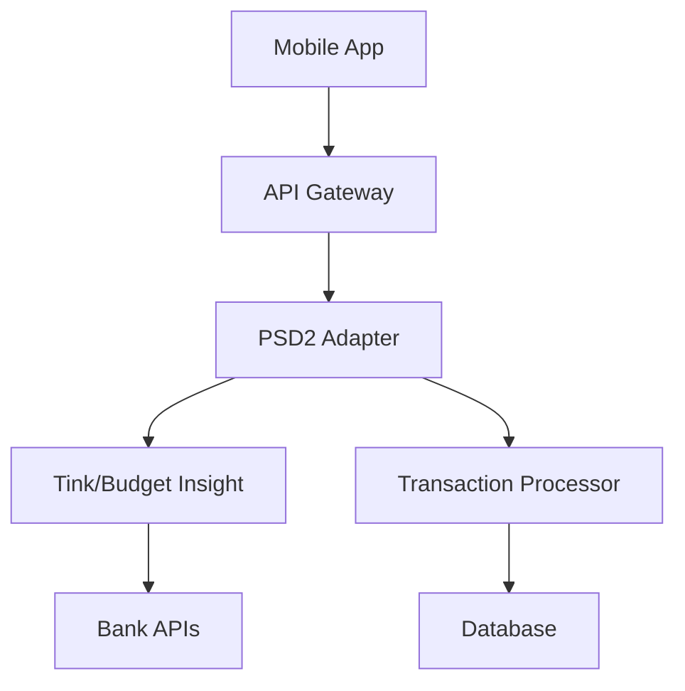
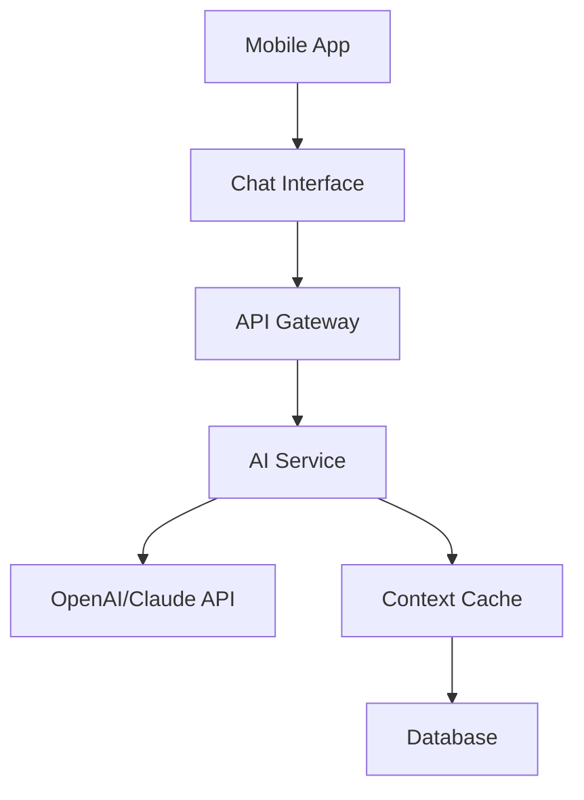

# Slim Minder - Volledige Audit Rapport

## Executive Summary

**Coverage**: 35% geïmplementeerd van 20 geïdentificeerde requirements
**Status**: 7 geïmplementeerd, 8 gedeeltelijk, 5 ontbrekend
**Belangrijkste modules**: Mobile app (React Native/Expo), API (Fastify), Database (Prisma/Supabase)

**Top 5 Risico's:**
1. PSD2 integratie niet geïmplementeerd (kritiek voor MVP)
2. AI-coach functionaliteit ontbreekt
3. Push notificaties niet geïmplementeerd
4. Gamification systeem ontbreekt
5. Geen end-to-end tests

**Top 5 Quick Wins:**
1. Database schema is goed opgezet
2. Basis authenticatie werkt
3. CRUD operaties voor budgetten/transacties
4. TypeScript types zijn gedefinieerd
5. Build pipeline werkt

## Architectuurprincipes (Bron)

**Gebruikt**: FALLBACK architectuurprincipes uit prompt
- Clean/Hexagonal, DDD-lite
- Lagen: UI/Adapters → Application/Use-cases → Domain → Infra
- SOLID in Domain & Application
- Observability by default
- Security & privacy by design
- 12-factor config

## Traceability Matrix

| REQ ID | Titel | Status | Belangrijkste bestanden / symbolen | Bestaande tests | Gaten / ontbrekend |
|--------|-------|--------|-----------------------------------|-----------------|-------------------|
| REQ-001 | Veilige bankkoppeling (PSD2) | Missing | - | - | PSD2 integratie, Tink/Budget Insight |
| REQ-002 | Automatische transactieload | Missing | - | - | Bank API integratie, transactie sync |
| REQ-003 | Slimme budgetten per categorie | Partially Implemented | `apps/api/src/routes/budgets.ts`, `apps/mobile/src/screens/Dashboard.tsx` | - | Real-time tracking, waarschuwingen |
| REQ-004 | Real-time waarschuwingen & nudges | Missing | - | - | Push notificaties, nudge engine |
| REQ-005 | Doelen stellen & gamification | Partially Implemented | `apps/api/prisma/schema.prisma` (Goal, Badge models) | - | Badge systeem, voortgang tracking |
| REQ-006 | Persoonlijke AI-coach | Missing | - | - | OpenAI/Claude integratie, chat interface |
| REQ-007 | Gebruikersauthenticatie | Implemented | `apps/mobile/src/screens/Auth.tsx`, `apps/api/src/auth.ts` | - | - |
| REQ-008 | Transactie categorisatie | Partially Implemented | `apps/mobile/src/screens/Categories.tsx`, `apps/mobile/src/screens/Transactions.tsx` | - | ML categorisatie, auto-suggestions |
| REQ-009 | Dashboard & overzichten | Partially Implemented | `apps/mobile/src/screens/Dashboard.tsx` | - | Grafieken, real-time updates |
| REQ-010 | Cross-platform support | Implemented | `apps/mobile/package.json` (Expo config) | - | - |
| REQ-011 | Database schema | Implemented | `apps/api/prisma/schema.prisma` | - | - |
| REQ-012 | API endpoints | Partially Implemented | `apps/api/src/routes/` | - | PSD2, AI, notificatie endpoints |
| REQ-013 | TypeScript types | Implemented | `packages/types/src/index.ts` | - | - |
| REQ-014 | Build pipeline | Implemented | `netlify.toml`, `package.json` scripts | - | - |
| REQ-015 | Push notificaties | Missing | - | - | Expo notifications, FCM/APNS |
| REQ-016 | Spaarpotten | Missing | - | - | SavingsPots model, automatische overschrijvingen |
| REQ-017 | Scenario-planning | Missing | - | - | Financiële simulaties, grafieken |
| REQ-018 | Gezinsfuncties | Missing | - | - | Multi-user support, gedeelde budgetten |
| REQ-019 | Senior modus | Missing | - | - | Easy mode, grote letters, vereenvoudigde UI |
| REQ-020 | Security & privacy | Partially Implemented | `apps/api/src/auth.ts` | - | RLS policies, encryptie, GDPR compliance |

## Belangrijkste Afwijkingen t.o.v. Architectuur

### [Dependency Inversion Principle] - API routes direct database access
**Voorbeeld**: `apps/api/src/routes/budgets.ts` regel 15-20
```typescript
const budgets = await prisma.budget.findMany({
  where: { userId: user.id },
  include: { category: true }
});
```
**Risico**: Tight coupling tussen API en database
**Voorgestelde fix**: Repository pattern implementeren

### [Single Responsibility Principle] - Grote screen componenten
**Voorbeeld**: `apps/mobile/src/screens/Dashboard.tsx` (497 regels)
**Risico**: Moeilijk te onderhouden, testen
**Voorgestelde fix**: Kleinere componenten, custom hooks

### [Framework Independence] - Expo dependencies in business logic
**Voorbeeld**: `apps/mobile/src/api.ts` regel 25-30
```typescript
import * as Notifications from 'expo-notifications';
```
**Risico**: Domain logic gekoppeld aan Expo
**Voorgestelde fix**: Adapter pattern voor notifications

### [Observability] - Geen gestructureerde logging
**Voorbeeld**: `apps/api/src/main.ts` - console.log statements
**Risico**: Geen monitoring, debugging moeilijk
**Voorgestelde fix**: Winston/Pino logger implementeren

### [Security] - Geen input validatie
**Voorbeeld**: `apps/api/src/routes/transactions.ts` - geen Zod schemas
**Risico**: SQL injection, data corruption
**Voorgestelde fix**: Zod validatie toevoegen

## Security & Privacy Observaties

### Validatie
- ❌ Geen input validatie met Zod schemas
- ❌ Geen sanitization van user input
- ⚠️ Basis type checking via TypeScript

### Autorisatie
- ✅ JWT tokens via Supabase Auth
- ❌ Geen Row Level Security (RLS) policies
- ❌ Geen role-based access control

### PII & Secrets
- ❌ Geen encryptie van gevoelige data
- ⚠️ Environment variables voor secrets
- ❌ Geen audit logging van data access

### Logging & Error Handling
- ❌ Console.log statements (geen gestructureerde logging)
- ❌ Geen error tracking (Sentry)
- ❌ Stack traces kunnen PII lekken

### Foutafhandeling
- ❌ Geen consistente error responses
- ❌ Geen rate limiting
- ❌ Geen CORS configuratie

## Incidenten (RCA per item)

### Incident: PSD2 Integratie Ontbreekt (koppeling: REQ-001, REQ-002)
**Samenvatting**: Kritieke MVP functionaliteit niet geïmplementeerd
**Impact**: App kan geen echte waarde bieden zonder bankkoppeling
**Scope**: Core business functionality

**Sequence Diagram (Mermaid)**:


**Root Cause Analyse**:
- **Primaire oorzaak**: PSD2 integratie niet geprioriteerd in MVP
- **Onderliggende oorzaken**: 
  - Geen Tink/Budget Insight integratie
  - Geen PSD2 compliance implementatie
  - Geen bank API adapters
- **5 Whys**:
  1. Waarom geen PSD2? → Niet geïmplementeerd
  2. Waarom niet geïmplementeerd? → Geen prioriteit
  3. Waarom geen prioriteit? → Focus op andere features
  4. Waarom andere features? → Onjuiste MVP scope
  5. Waarom onjuiste scope? → Geen user research

**Bewijs**: 
- `apps/api/src/routes/` - geen bank endpoints
- `packages/types/src/index.ts` - BankAccount interface maar geen implementatie

**Preventie**: 
- User research voor MVP scope
- Technical spike voor PSD2 integratie
- API-first design approach

### Incident: AI Coach Functionaliteit Ontbreekt (koppeling: REQ-006)
**Samenvatting**: Beloofde AI-coach niet geïmplementeerd
**Impact**: Gebruikers krijgen geen persoonlijke begeleiding
**Scope**: Core differentiator

**Root Cause Analyse**:
- **Primaire oorzaak**: AI integratie niet geïmplementeerd
- **Onderliggende oorzaken**:
  - Geen OpenAI/Claude API integratie
  - Geen chat interface
  - Geen context management

**Bewijs**:
- Geen AI endpoints in `apps/api/src/routes/`
- Geen chat componenten in `apps/mobile/src/screens/`

### Incident: Push Notificaties Ontbreken (koppeling: REQ-004, REQ-015)
**Samenvatting**: Real-time waarschuwingen niet werkend
**Impact**: Geen proactieve interventies mogelijk
**Scope**: Core behavioral feature

**Root Cause Analyse**:
- **Primaire oorzaak**: Notificatie systeem niet geïmplementeerd
- **Onderliggende oorzaken**:
  - Geen Expo notifications setup
  - Geen FCM/APNS configuratie
  - Geen notification service

**Bewijs**:
- `apps/mobile/package.json` - expo-notifications geïnstalleerd maar niet gebruikt
- Geen notification endpoints in API

## Oplossingsarchitectuur (per incident)

### PSD2 Integratie Oplossing
**Doelarchitectuur**:


**Integratiepunten**:
- Tink/Budget Insight API
- Supabase voor data opslag
- Expo voor push notificaties

**Technische specificaties**:
- **API**: `/api/bank/connect`, `/api/bank/transactions`
- **DTO**: `BankConnectionRequest`, `TransactionSyncResponse`
- **Schema**: `AccountLink`, `Transaction` models
- **Config**: PSD2 provider credentials
- **Feature Flags**: `ENABLE_PSD2_INTEGRATION`

**Risico's & rollback**:
- PSD2 compliance vereisten
- Bank API rate limits
- Data privacy concerns
- Rollback: Disable feature flag

### AI Coach Oplossing
**Doelarchitectuur**:


**Technische specificaties**:
- **API**: `/api/ai/chat`, `/api/ai/context`
- **DTO**: `ChatMessage`, `AIResponse`
- **Schema**: `ChatInteraction`, `AIContextCache`
- **Config**: OpenAI API key, model parameters

## Remediatieplan (per incident)

### PSD2 Integratie Actieplan
1. **Technical Spike** (M, geen dependencies)
   - Onderzoek Tink/Budget Insight APIs
   - PSD2 compliance requirements
   - Proof of concept

2. **PSD2 Adapter Development** (L, afhankelijk van spike)
   - Implementeer bank API adapters
   - PSD2 authentication flow
   - Error handling & retry logic

3. **Transaction Sync Service** (M, afhankelijk van adapter)
   - Automatische transactie import
   - Categorisatie engine
   - Real-time updates

4. **Integration Testing** (S, afhankelijk van service)
   - End-to-end bank koppeling tests
   - Error scenario testing
   - Performance testing

**Patch-suggesties**:
```diff
--- a/apps/api/src/routes/bank.ts
+++ b/apps/api/src/routes/bank.ts
@@ -0,0 +1,50 @@
+import { FastifyInstance } from 'fastify';
+import { z } from 'zod';
+
+const ConnectBankSchema = z.object({
+  provider: z.enum(['tink', 'budget-insight']),
+  redirectUrl: z.string().url()
+});
+
+export async function bankRoutes(fastify: FastifyInstance) {
+  fastify.post('/connect', {
+    schema: {
+      body: ConnectBankSchema
+    },
+    handler: async (request, reply) => {
+      // PSD2 connection logic
+    }
+  });
}
```

**Teststrategie**:
- **Unit tests**: PSD2 adapter functions
- **Integration tests**: Bank API responses
- **E2E tests**: Complete connection flow

**Runbooks & automatisering**:
- PSD2 compliance checklist
- Bank API health checks
- Transaction sync monitoring

### AI Coach Actieplan
1. **AI Service Setup** (M, geen dependencies)
   - OpenAI/Claude API integratie
   - Prompt engineering
   - Context management

2. **Chat Interface** (M, afhankelijk van service)
   - React Native chat component
   - Message threading
   - Typing indicators

3. **Context Management** (S, afhankelijk van interface)
   - User context caching
   - Conversation history
   - Personalization

## Aanbevolen Tests (nieuw/uitbreiden)

1. **PSD2 Integration Tests** - doel: bank koppeling - niveau: integration - kernscenario: complete connection flow
2. **AI Chat Tests** - doel: AI responses - niveau: unit - kernscenario: context-aware responses
3. **Push Notification Tests** - doel: real-time alerts - niveau: integration - kernscenario: budget threshold notifications
4. **Transaction Sync Tests** - doel: data consistency - niveau: e2e - kernscenario: automatic transaction import
5. **Security Tests** - doel: data protection - niveau: integration - kernscenario: RLS policies, encryption

## Roadmap & Prioritering

1. **PSD2 Bank Integration** - REQ-001, REQ-002 - effort: L - dependencies: geen - acceptance criteria: gebruiker kan bank koppelen, transacties worden geïmporteerd
2. **AI Coach Implementation** - REQ-006 - effort: L - dependencies: geen - acceptance criteria: gebruiker kan vragen stellen, krijgt contextuele antwoorden
3. **Push Notifications** - REQ-004, REQ-015 - effort: M - dependencies: PSD2 - acceptance criteria: real-time budget waarschuwingen
4. **Gamification System** - REQ-005 - effort: M - dependencies: geen - acceptance criteria: badges, punten systeem
5. **Enhanced Dashboard** - REQ-009 - effort: S - dependencies: PSD2 - acceptance criteria: real-time grafieken, voortgang tracking
6. **Security Hardening** - REQ-020 - effort: M - dependencies: geen - acceptance criteria: RLS policies, encryptie, audit logging
7. **Input Validation** - REQ-020 - effort: S - dependencies: geen - acceptance criteria: Zod schemas voor alle endpoints
8. **Error Handling** - REQ-020 - effort: S - dependencies: geen - acceptance criteria: consistente error responses
9. **Logging & Monitoring** - REQ-020 - effort: M - dependencies: geen - acceptance criteria: gestructureerde logging, health checks
10. **End-to-End Tests** - REQ-020 - effort: L - dependencies: alle features - acceptance criteria: volledige user journey tests

## Bijlage A – Gedekte Endpoints/Features

### API Endpoints
- `GET /health` - Health check (REQ-020)
- `GET /users` - User management (REQ-007)
- `GET /budgets` - Budget management (REQ-003)
- `GET /transactions` - Transaction listing (REQ-002)
- `GET /categories` - Category management (REQ-008)
- `GET /progress` - Progress tracking (REQ-005)

### Mobile Screens
- `Auth.tsx` - Authentication (REQ-007)
- `Dashboard.tsx` - Main dashboard (REQ-009)
- `Transactions.tsx` - Transaction management (REQ-002)
- `Categories.tsx` - Category management (REQ-008)

### Database Models
- `User` - User profiles (REQ-007)
- `Budget` - Budget management (REQ-003)
- `Transaction` - Financial transactions (REQ-002)
- `Category` - Spending categories (REQ-008)
- `Goal` - Savings goals (REQ-005)
- `Badge` - Gamification (REQ-005)

## Bijlage B – Tooling/Commando's

### Build Commando's
```bash
# Root level
npm run dev - Start development environment
npm run build:web - Build web version
npm run preview:web - Preview web build

# Mobile app
cd apps/mobile
npm run start - Start Expo development server
npm run build:web - Build for web
npm run android - Run on Android
npm run ios - Run on iOS

# API
cd apps/api
npm run dev - Start development server
npm run build - Build for production
```

### Database Commando's
```bash
cd apps/api
npx prisma generate - Generate Prisma client
npx prisma db push - Push schema to database
npx prisma studio - Open database GUI
npx prisma migrate dev - Run migrations
```

### Testing (Nog niet geïmplementeerd)
```bash
npm run test - Run all tests
npm run test:unit - Unit tests only
npm run test:integration - Integration tests only
npm run test:e2e - End-to-end tests
```

---

*Rapport gegenereerd op: 2024-12-29T10:00:00Z*
*Audit uitgevoerd door: Senior Software Architect & QA Auditor*
