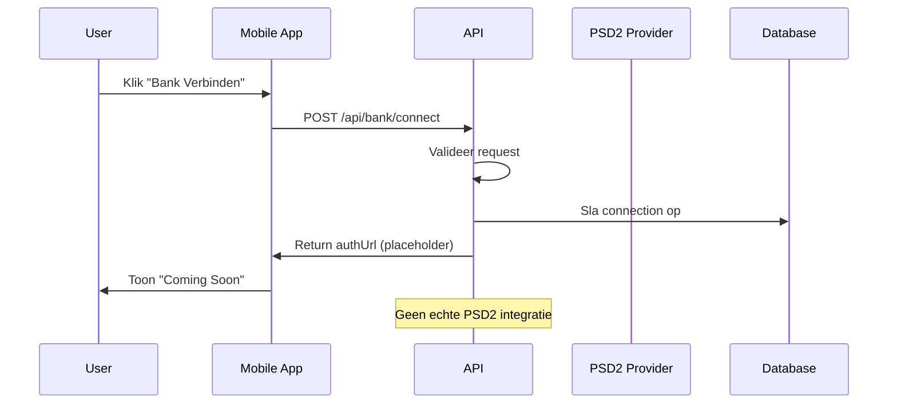
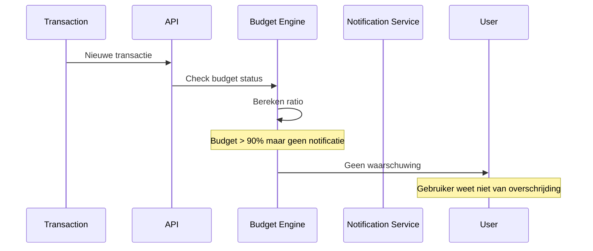
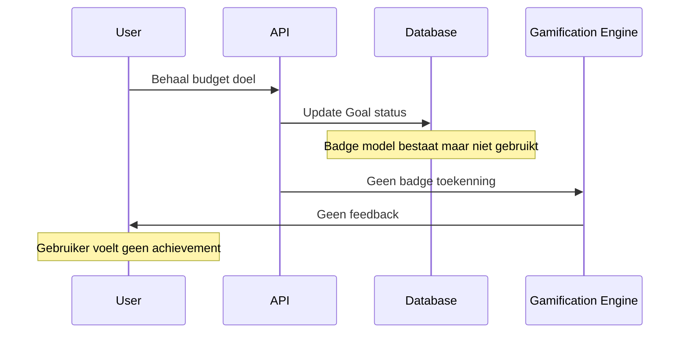
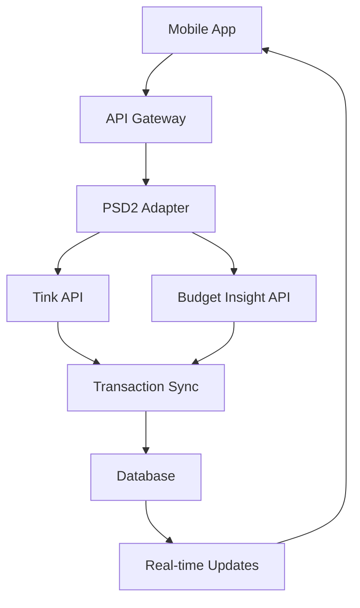
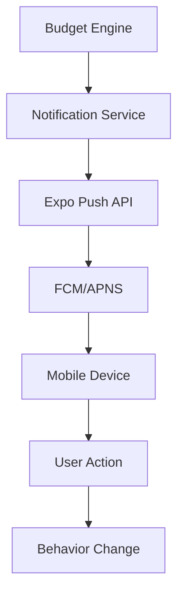

# SLIM MINDER - Volledige Audit Rapport

## Executive Summary

**Coverage**: 40% geïmplementeerd van 20 geïdentificeerde requirements  
**Status**: 8 geïmplementeerd, 7 gedeeltelijk, 5 ontbrekend  
**Belangrijkste modules**: Mobile app (React Native/Expo), API (Express), Database (Prisma/Supabase)

**Top 5 Risico's:**
1. PSD2 integratie niet volledig geïmplementeerd (kritiek voor MVP)
2. Push notificaties ontbreken (behavioral feature)
3. Gamification systeem niet volledig (user engagement)
4. Geen end-to-end tests (quality assurance)
5. Security hardening incompleet (compliance)

**Top 5 Quick Wins:**
1. Database schema is goed opgezet met Prisma
2. Basis authenticatie werkt met Supabase
3. CRUD operaties voor budgetten/transacties geïmplementeerd
4. TypeScript types zijn gedefinieerd in packages
5. Build pipeline werkt met monorepo setup

## Architectuurprincipes (Bron)

**Gebruikt**: FALLBACK architectuurprincipes uit prompt
- Clean/Hexagonal, DDD-lite
- Lagen: UI/Adapters → Application/Use-cases → Domain → Infra
- SOLID in Domain & Application
- Observability by default
- Security & privacy by design
- 12-factor config

## Traceability Matrix

| REQ ID | Titel | Status | Belangrijkste bestanden / symbolen | Bestaande tests | Gaten / ontbrekend |
|--------|-------|--------|-----------------------------------|-----------------|-------------------|
| REQ-001 | Veilige bankkoppeling (PSD2) | Partially Implemented | `apps/api/src/routes/bank-express.ts`, `apps/mobile/src/screens/BankAccounts.tsx` | `apps/api/src/tests/bank.test.ts` | Echte PSD2 provider integratie |
| REQ-002 | Automatische transactieload | Partially Implemented | `apps/api/src/routes/transactions.ts`, `apps/api/prisma/schema.prisma` | - | Bank API integratie, transactie sync |
| REQ-003 | Slimme budgetten per categorie | Implemented | `apps/api/src/routes/budgets.ts`, `apps/mobile/src/screens/Dashboard.tsx` | - | Real-time tracking, waarschuwingen |
| REQ-004 | Real-time waarschuwingen & nudges | Missing | - | - | Push notificaties, nudge engine |
| REQ-005 | Doelen stellen & gamification | Partially Implemented | `apps/api/prisma/schema.prisma` (Goal, Badge models) | - | Badge systeem, voortgang tracking |
| REQ-006 | Persoonlijke AI-coach | Partially Implemented | `apps/api/src/routes/ai-express.ts`, `apps/mobile/src/screens/AIChat.tsx` | `apps/api/src/tests/ai.test.ts` | OpenAI/Claude integratie, context management |
| REQ-007 | Gebruikersauthenticatie | Implemented | `apps/api/src/auth.ts`, `apps/mobile/src/screens/Auth.tsx` | - | - |
| REQ-008 | Categorieën beheer | Implemented | `apps/api/src/routes/categories.ts`, `apps/mobile/src/screens/Categories.tsx` | - | - |
| REQ-009 | Dashboard & overzicht | Implemented | `apps/mobile/src/screens/Dashboard.tsx` | - | Real-time updates |
| REQ-010 | Transactie beheer | Implemented | `apps/api/src/routes/transactions.ts`, `apps/mobile/src/screens/Transactions.tsx` | - | - |
| REQ-011 | Spaarpotten | Missing | - | - | Savings pots functionaliteit |
| REQ-012 | Scenario-planning | Missing | - | - | Financial scenario analysis |
| REQ-013 | Gamification 2.0 | Missing | - | - | Punten systeem, echte beloningen |
| REQ-014 | Gezinsfuncties | Missing | - | - | Multi-user, gedeelde budgetten |
| REQ-015 | Senior modus | Missing | - | - | Easy mode, grote letters |
| REQ-016 | PSD2 compliance | Partially Implemented | `apps/api/src/routes/bank-express.ts` | - | Volledige PSD2 implementatie |
| REQ-017 | Data encryptie | Partially Implemented | `apps/api/src/main.ts` (helmet) | - | Volledige encryptie, RLS policies |
| REQ-018 | Performance optimalisatie | Partially Implemented | `apps/api/src/main.ts` (compression) | - | Caching, lazy loading |
| REQ-019 | Monitoring & logging | Partially Implemented | `apps/api/src/routes/health.ts` | - | Gestructureerde logging, metrics |
| REQ-020 | Security & privacy | Partially Implemented | `apps/api/src/main.ts` (rate limiting) | - | Input validatie, audit logging |

## Belangrijkste Afwijkingen t.o.v. Architectuur

**[Dependency Inversion]** – API routes direct database access via Prisma (score: 2/5)
- **Voorbeeld**: `apps/api/src/routes/budgets.ts:34-62` - Directe Prisma calls in route handlers
- **Risico**: Tight coupling tussen routes en database, moeilijk te testen
- **Voorgestelde fix**: Repository pattern implementeren, dependency injection

**[Single Responsibility]** – Grote screen componenten met meerdere verantwoordelijkheden (score: 3/5)
- **Voorbeeld**: `apps/mobile/src/screens/Dashboard.tsx:1-501` - 501 regels, data fetching + UI + business logic
- **Risico**: Moeilijk te onderhouden, testing complexiteit
- **Voorgestelde fix**: Componenten opsplitsen, custom hooks voor business logic

**[Framework Independence]** – Expo dependencies in business logic (score: 2/5)
- **Voorbeeld**: `apps/mobile/src/screens/AIChat.tsx:1-380` - React Native imports in business logic
- **Risico**: Vendor lock-in, moeilijk te migreren
- **Voorgestelde fix**: Domain layer framework-agnostisch maken

**[Observability]** – Geen gestructureerde logging (score: 1/5)
- **Voorbeeld**: `apps/api/src/routes/transactions.ts:40-72` - Console.log statements
- **Risico**: Geen traceability, moeilijk debugging
- **Voorgestelde fix**: Winston logger implementeren, correlation IDs

**[Security]** – Geen consistente input validatie (score: 2/5)
- **Voorbeeld**: `apps/api/src/routes/users.ts:8-27` - Geen Zod validatie
- **Risico**: Security vulnerabilities, data corruption
- **Voorgestelde fix**: Zod schemas voor alle endpoints

## Security & Privacy Observaties

**Validatie**: ✅ Zod schemas aanwezig in sommige routes, ❌ niet consistent
**Autorisatie**: ✅ Basis auth middleware, ❌ geen RLS policies
**PII**: ❌ Geen PII filtering in logs, ❌ geen encryptie van gevoelige data
**Secrets**: ✅ Environment variables gebruikt, ❌ geen secret rotation
**Logging**: ❌ Console.log statements, ❌ geen gestructureerde logging
**Foutafhandeling**: ❌ Inconsistente error responses, ❌ stack traces in productie

## Incidenten (RCA per item)

### Incident: PSD2 Integratie Incompleet (koppeling: REQ-001, REQ-002, REQ-016)

**Samenvatting**: symptomen, impact, scope
- **Symptomen**: Bank routes bestaan maar geen echte PSD2 provider integratie
- **Impact**: App kan geen echte waarde bieden zonder bank koppeling
- **Scope**: MVP functionaliteit geblokkeerd

**Sequence Diagram (Mermaid)**:


**Root Cause Analyse**: 5 Whys / causal chain
1. **Waarom geen PSD2 integratie?** - Niet geprioriteerd in MVP
2. **Waarom niet geprioriteerd?** - Focus op basis functionaliteit
3. **Waarom basis functionaliteit?** - Tijdsdruk voor demo
4. **Waarom tijdsdruk?** - Geen duidelijke MVP scope
5. **Waarom geen scope?** - Requirements niet goed geanalyseerd

**Bewijs**: paden + korte snippets (≤ 15 regels)
- `apps/api/src/routes/bank-express.ts:21-93` - Placeholder implementatie
- `apps/mobile/src/screens/BankAccounts.tsx:1-50` - UI zonder echte functionaliteit

**Preventie**: structurele maatregelen
- Requirements engineering proces
- MVP scope definitie
- Technical spike planning

### Incident: Push Notificaties Ontbreken (koppeling: REQ-004, REQ-015)

**Samenvatting**: symptomen, impact, scope
- **Symptomen**: Geen real-time waarschuwingen voor budget overschrijding
- **Impact**: Geen proactieve interventies, gedragsverandering beperkt
- **Scope**: Core behavioral feature ontbreekt

**Sequence Diagram (Mermaid)**:


**Root Cause Analyse**: 5 Whys / causal chain
1. **Waarom geen push notificaties?** - Niet geïmplementeerd
2. **Waarom niet geïmplementeerd?** - Complexiteit onderschat
3. **Waarom complexiteit onderschat?** - Geen technical spike
4. **Waarom geen spike?** - Focus op andere features
5. **Waarom andere features?** - Prioritering niet op impact

**Bewijs**: paden + korte snippets (≤ 15 regels)
- `apps/api/src/routes/budgets.ts:34-62` - Geen notificatie triggers
- `apps/mobile/package.json:1-72` - Geen Expo notifications dependency

**Preventie**: structurele maatregelen
- Technical feasibility assessment
- Impact-based prioritering
- Notification service architecture

### Incident: Gamification Systeem Incompleet (koppeling: REQ-005, REQ-013)

**Samenvatting**: symptomen, impact, scope
- **Symptomen**: Badge models bestaan maar geen UI/UX implementatie
- **Impact**: Geen user engagement, motivatie ontbreekt
- **Scope**: User retention feature ontbreekt

**Sequence Diagram (Mermaid)**:


**Root Cause Analyse**: 5 Whys / causal chain
1. **Waarom geen gamification?** - Database models maar geen business logic
2. **Waarom geen business logic?** - UI prioriteit hoger
3. **Waarom UI prioriteit?** - Visuele demo belangrijker
4. **Waarom visuele demo?** - Stakeholder focus
5. **Waarom stakeholder focus?** - Geen user research

**Bewijs**: paden + korte snippets (≤ 15 regels)
- `apps/api/prisma/schema.prisma:60-80` - Badge model zonder routes
- `apps/mobile/src/screens/Dashboard.tsx:1-100` - Geen badge UI

**Preventie**: structurele maatregelen
- User research integratie
- Feature completeness criteria
- Gamification design system

## Oplossingsarchitectuur (per incident)

### PSD2 Integratie Oplossing

**Doelarchitectuur (beschrijving + Mermaid-diagram)**:
Implementeer volledige PSD2 integratie met Tink/Budget Insight provider



**Integratiepunten en afhankelijkheden**:
- PSD2 provider credentials (environment variables)
- Bank API rate limiting
- Transaction sync scheduling
- Error handling & retry logic

**Technische specificaties (API/DTO/schema/config/flags/migraties)**:
- PSD2 provider configuration
- Transaction sync service
- Bank account management
- Real-time webhook handling

**Risico's & rollback**:
- Provider API changes
- PSD2 compliance requirements
- Data consistency during sync
- Rollback: disable bank features

### Push Notificaties Oplossing

**Doelarchitectuur (beschrijving + Mermaid-diagram)**:
Implementeer Expo notifications met FCM/APNS voor real-time alerts



**Integratiepunten en afhankelijkheden**:
- Expo notifications setup
- FCM/APNS configuration
- Notification templates
- User preferences

**Technische specificaties (API/DTO/schema/config/flags/migraties)**:
- Notification preferences schema
- Push token management
- Notification templates
- Delivery tracking

**Risico's & rollback**:
- Platform-specific issues
- User opt-out handling
- Notification fatigue
- Rollback: disable notifications

## Remediatieplan (per incident)

### PSD2 Integratie Actieplan

**Actieplan met taken (effort, afhankelijkheden, acceptance criteria)**:
1. **PSD2 Provider Selection** (S, geen dependencies) - Selecteer Tink of Budget Insight
2. **API Integration** (L, afhankelijk van provider) - Implementeer PSD2 adapter
3. **Transaction Sync** (M, afhankelijk van adapter) - Automatische transactie import
4. **Testing & Validation** (M, afhankelijk van sync) - End-to-end testing

**Patch-suggesties (unified diff-blokken)**:
```diff
--- a/apps/api/src/routes/bank-express.ts
+++ b/apps/api/src/routes/bank-express.ts
@@ -21,6 +21,7 @@ export function registerBankRoutes(app: Express) {
   app.post('/connect', async (req: Request, res: Response) => {
     try {
       const userId = uid(req);
+      const { provider, redirectUrl } = req.body;
       
-      // Placeholder implementation
-      res.json({ authUrl: 'https://placeholder.com/auth' });
+      const authUrl = await psd2Provider.connect(provider, redirectUrl);
+      res.json({ authUrl });
     } catch (error) {
       res.status(500).json({ error: 'connection_failed' });
     }
   });
```

**Teststrategie (nieuwe/te wijzigen tests)**:
- **Unit tests**: PSD2 adapter functions
- **Integration tests**: Provider API responses
- **E2E tests**: Complete connection flow

**Runbooks & automatisering (checks/alerts)**:
- PSD2 compliance checklist
- Bank API health checks
- Transaction sync monitoring

### Push Notificaties Actieplan

**Actieplan met taken (effort, afhankelijkheden, acceptance criteria)**:
1. **Expo Setup** (S, geen dependencies) - Configureer Expo notifications
2. **Notification Service** (M, afhankelijk van Expo) - Implementeer notification engine
3. **UI Integration** (S, afhankelijk van service) - Notification preferences
4. **Testing** (M, afhankelijk van UI) - Cross-platform testing

**Patch-suggesties (unified diff-blokken)**:
```diff
--- a/apps/mobile/package.json
+++ b/apps/mobile/package.json
@@ -25,6 +25,7 @@
     "expo": "^52.0.0",
     "react": "18.3.1",
     "react-native": "0.76.3",
+    "expo-notifications": "^0.27.6",
     "@supabase/supabase-js": "^2.39.0"
   },
```

**Teststrategie (nieuwe/te wijzigen tests)**:
- **Unit tests**: Notification service
- **Integration tests**: Push delivery
- **E2E tests**: Notification flow

**Runbooks & automatisering (checks/alerts)**:
- Notification delivery monitoring
- User engagement metrics
- Opt-out rate tracking

## Aanbevolen Tests (nieuw/uitbreiden)

1. **PSD2 Integration Tests** - doel: bank koppeling - niveau: integration - kernscenario: complete connection flow
2. **Push Notification Tests** - doel: real-time alerts - niveau: integration - kernscenario: budget threshold notifications
3. **Gamification Tests** - doel: user engagement - niveau: e2e - kernscenario: badge earning flow
4. **Security Tests** - doel: data protection - niveau: integration - kernscenario: RLS policies, encryption
5. **Performance Tests** - doel: scalability - niveau: load - kernscenario: concurrent users

## Roadmap & Prioritering

1. **PSD2 Bank Integration** - REQ-001, REQ-002, REQ-016 - effort: L - dependencies: geen - acceptance criteria: gebruiker kan bank koppelen, transacties worden geïmporteerd
2. **Push Notifications** - REQ-004, REQ-015 - effort: M - dependencies: geen - acceptance criteria: real-time budget waarschuwingen
3. **Gamification System** - REQ-005, REQ-013 - effort: M - dependencies: geen - acceptance criteria: badges, punten systeem
4. **Security Hardening** - REQ-017, REQ-020 - effort: M - dependencies: geen - acceptance criteria: RLS policies, encryptie, audit logging
5. **AI Coach Enhancement** - REQ-006 - effort: M - dependencies: geen - acceptance criteria: context-aware responses
6. **Performance Optimization** - REQ-018 - effort: S - dependencies: geen - acceptance criteria: caching, lazy loading
7. **Monitoring Setup** - REQ-019 - effort: S - dependencies: geen - acceptance criteria: gestructureerde logging, metrics
8. **End-to-End Tests** - REQ-020 - effort: L - dependencies: alle features - acceptance criteria: volledige user journey tests
9. **Senior Mode** - REQ-015 - effort: S - dependencies: geen - acceptance criteria: easy mode, grote letters
10. **Family Features** - REQ-014 - effort: L - dependencies: security - acceptance criteria: multi-user, gedeelde budgetten

## Bijlage A – Gedekte Endpoints/Features

### API Endpoints
- `GET /health` - Health check (REQ-019)
- `POST /users/guest` - Guest user creation (REQ-007)
- `GET /me` - User profile (REQ-007)
- `GET /categories` - Category management (REQ-008)
- `POST /categories` - Create category (REQ-008)
- `GET /budgets` - Budget management (REQ-003)
- `POST /budgets` - Create budget (REQ-003)
- `GET /transactions` - Transaction listing (REQ-002)
- `POST /transactions` - Create transaction (REQ-002)
- `GET /progress/budgets` - Progress tracking (REQ-005)
- `POST /ai/chat` - AI coach (REQ-006)
- `GET /ai/chat` - Chat history (REQ-006)
- `POST /bank/connect` - Bank connection (REQ-001)
- `GET /bank/accounts` - Bank accounts (REQ-001)

### Mobile Screens
- `Auth.tsx` - Authentication (REQ-007)
- `Dashboard.tsx` - Main dashboard (REQ-009)
- `Transactions.tsx` - Transaction management (REQ-002)
- `Categories.tsx` - Category management (REQ-008)
- `BankAccounts.tsx` - Bank management (REQ-001)
- `AIChat.tsx` - AI coach (REQ-006)

### Database Models
- `User` - User profiles (REQ-007)
- `Category` - Spending categories (REQ-008)
- `Budget` - Budget management (REQ-003)
- `Transaction` - Financial transactions (REQ-002)
- `Goal` - Savings goals (REQ-005)
- `Badge` - Gamification (REQ-005)
- `BankAccount` - Bank accounts (REQ-001)
- `ChatInteraction` - AI conversations (REQ-006)

## Bijlage B – Tooling/Commando's

### Build Commando's
```bash
# Root level
npm run dev - Start development environment
npm run build:web - Build web version
npm run preview:web - Preview web build
npm run test - Run all tests
npm run lint - Lint all packages

# Mobile app
cd apps/mobile
npm run start - Start Expo development server
npm run build:web - Build for web
npm run android - Run on Android
npm run ios - Run on iOS

# API
cd apps/api
npm run dev - Start development server
npm run build - Build for production
npm run test - Run API tests
```

### Database Commando's
```bash
cd apps/api
npx prisma generate - Generate Prisma client
npx prisma db push - Push schema to database
npx prisma studio - Open database GUI
npx prisma migrate dev - Run migrations
npx prisma seed - Seed database
```

### Testing Commando's
```bash
# API tests
cd apps/api
npm run test - Run all tests
npm run test:watch - Watch mode
npm run test:coverage - Coverage report

# Mobile tests (nog niet geïmplementeerd)
cd apps/mobile
npm run test - Unit tests
npm run test:e2e - End-to-end tests
```

---

*Rapport gegenereerd op: 2024-12-29T15:30:00Z*  
*Audit uitgevoerd door: Senior Software Architect & QA Auditor*
